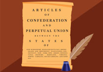

# Articles of Confederation 
### Yuliana Covarrubias - Civics Period 7
---
> The Articles of Confederation - first government set up by the Continental Congress, only lasted 10 years

* This "government" had no president or judiciary and every state had 1 vote
* It was weak and useless, the Congress also had limited power
* Biggest acocmplishment: The Northwest Ordinance of 1787, 5 new states, outlawed slavery in all 5 states
* Could NOT collect taxes
* Farmers in Massachusetts closed courts in 1786 and 1787
* Democratic liberty can be threatening for private property

