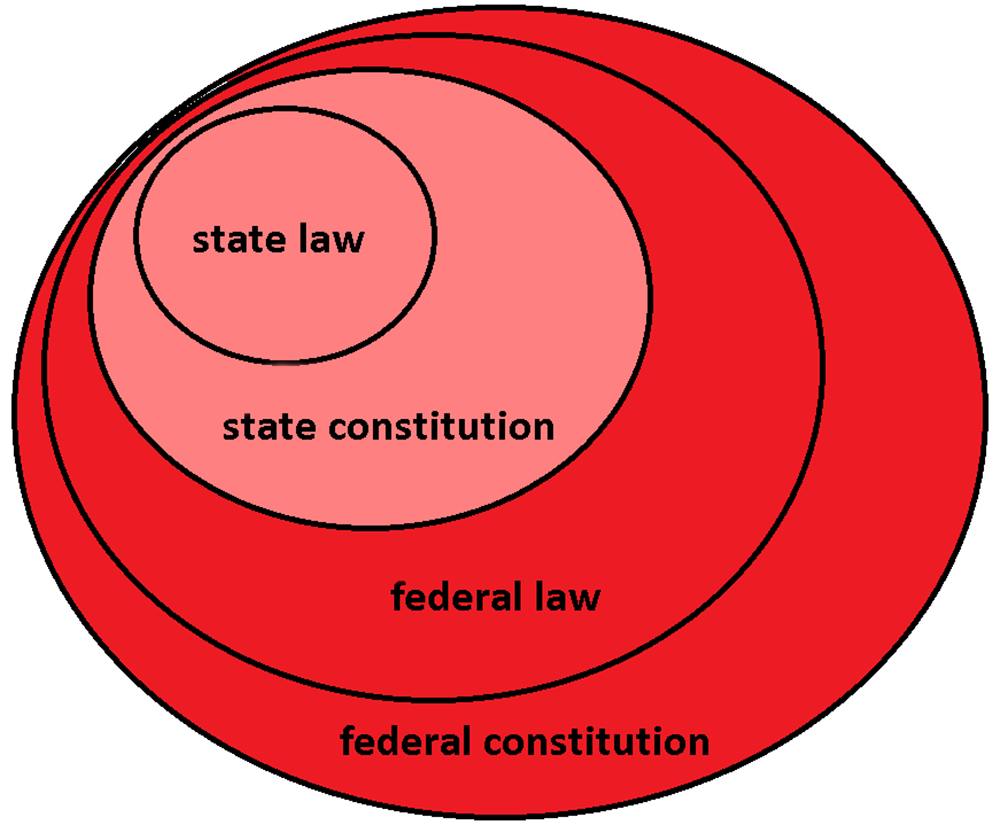

# Federalism
## Date: Thursday, October 3 2024
### Yuliana Covarrubias, Civics Period 7

> Federalism - a mode of government that combines a general government with regional governments in a single political system, dividing the powers between the two

## Types of Powers
1. National (Federal) Government Powers
1. State Government Powers
1. National and State Government (Concurrent) Powers

## Powers in Detail

| National Governments | Both | State Government |
| :---: | :---: | :---: |
| Regulate foreign & interstate commerce | Levy taxes | Regulate intrastate commerce |
| Coin money | Borrow money | Establish and maintain schools | 
| Tax imports/exports | Administer courts | Establish local governments |
| Establish & regulate the postal system| Make and enforce laws | Issue liscenses, permits, & certificates |
| Conduct foreign relations & made treaties| Build roads and transportation systems | Protect public health, safety, and morals |
| Create/maintain armed forces| Take private land for public use with just compensation| Maintain state militia (National Guard) |
| Declare war| Charter banks & corporations| Ratify amendments to the U.S Constitution |

