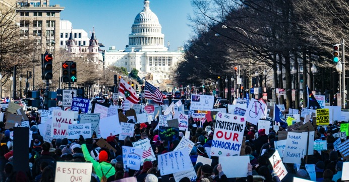

# Foundations of American Democracy
### ***Types of Democracy***
*  **Participatory Democracy:** Direct democracy - emphasizes broad participation in the political process by most, if not all, members of society.
* **Pluralist Democracy:** groups of people associate with interest groups who them compete to influence policy (Political parties)
* **Elite Democracy:** Limited participation in policy making on the assumption that government is complicated and the most educated people to run it
* **Republicanism:** People elect leaders to represent them and create laws in the public interest, representative
---
### ***Principles of democracy***
* **Natural rights:** rights people posses by natural law apart from a government
* **Popular Sovereignty:** by nature, the power to govern is in the hands of the people
* **Social Contract:** People willingly give up some of that power away to a government, in order to protect their natural rigths
* **Limited Government:** A government that is prevented from tyranny through a system of checks and balances and distribution of power among several acting members
* **Separation of powers:** (Fed 51. -Montesquieu) Power split into Legislative, Executive, and Judicial (Federal and Supreme Courts)
---
### ***Constitutional Compromises***
* **The Great Compromise:** How people would be represented in new congress
* **Three-Fifths Compromise:** 3/5 enslaved population would count towards representation
---
### ***Federalists vs. Anti-Federalists***
* **Anti federalism** (Brutus) =  no bigger central government and large republic- they fear the government taking away peoples rights, opt for not ratifying new constitution
* Brutus N.1 Anti Federalist Paper
* **Federalist:** They WANT a new constitution, ratify it.
Federalism - protection built in structure, separation of power.
---
### ***Clauses***
* **Elastic clause, Necessary and Proper Clause:** Stretch power, expand Congress powers, create tyranny, deciding they need a bank
* **Commerce Clause:** allows congress regulate economic actions that crosses between states (business, money) 
Fed 10. James Madison
* **Supremacy Clause:** This clause in the new Constitution was  feared because it gave the new, national government ultimate authority when it came to power disputes between the national and state govenrments.

